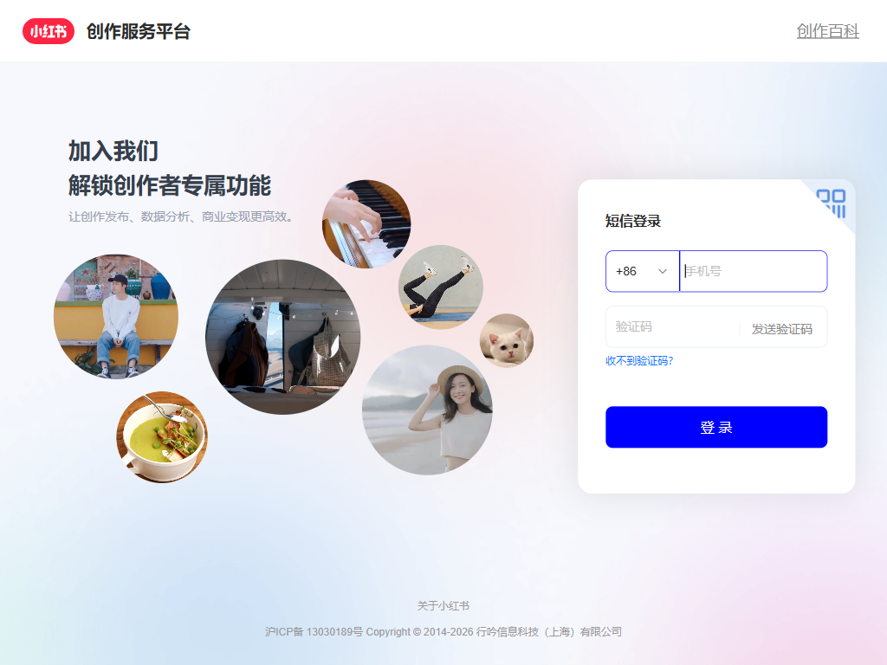
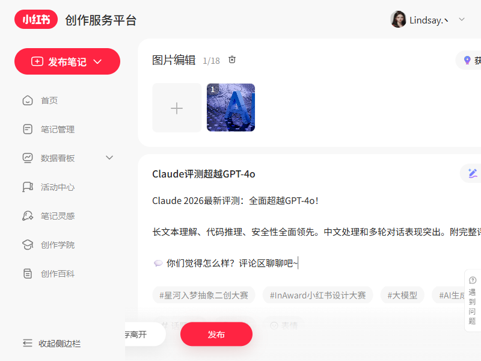

# Xiaohongshu Agent

小红书内容工作台，面向 Windows，支持：

- `MCP` 登录授权
- 原贴抓取与详情补抓
- 图文 / 视频理解
- 阅读笔记生成
- 草稿审核与草稿管理
- 中文网页 Demo
- 本地 `Ollama` 优先模型路由

## 推荐配置

项目当前最推荐的本地方案是：

- `LJY` conda 环境
- `xhs-mcp`
- `Ollama`
- 模型：`gemma4:e4b`

### 快速启动

```powershell
conda activate LJY
python -m pip install -r requirements.txt
streamlit run web_app.py
```

### Ollama

```powershell
ollama pull gemma4:e4b
curl http://localhost:11434/api/tags
```

`.env` 中建议至少配置：

```env
OLLAMA_BASE_URL=http://localhost:11434
OLLAMA_MODEL=gemma4:e4b
XHS_BACKEND=mcp
```

## 网页 Demo 截图

当前先使用占位图，后面你可以直接替换同名文件。





## 详细说明

完整文档见：

- [docs/README.md](./docs/README.md)
- [docs/PROJECT_STRUCTURE.md](./docs/PROJECT_STRUCTURE.md)
