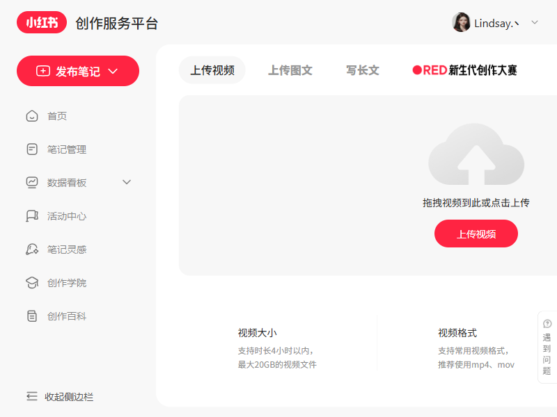

# Xiaohongshu Agent

面向 Windows 的小红书内容工作台。项目把“登录授权、原贴抓取、图文/视频理解、阅读笔记生成、草稿审核、草稿管理、发布”串成了一条完整链路，并提供了中文网页 Demo 方便日常操作。

## 项目定位

这个项目不是单纯的爬虫，也不是单纯的发帖工具，而是一套“小红书内容生产控制台”：

- 先抓真实原贴，而不是只拿标题做二次生成
- 对图文和视频都做内容理解，形成阅读笔记
- 对草稿做来源、引用、详实度等审核
- 在网页中集中查看、筛选、收藏、发布

## 当前能力

- `MCP` 登录授权与登录状态管理
- 小红书原贴搜索、详情补抓、来源信息保留
- 图文帖图片理解、OCR 文本转写、阅读笔记生成
- 视频帖转写、摘要、关键媒体信息处理
- 草稿审核、草稿收藏、原贴收藏、发布
- 中文 Streamlit 网页控制台
- 本地 `Ollama` / `DeepSeek` / `OpenAI` / 本地降级 多模式路由

## 技术路线

### 1. 登录与发布

- 默认后端：`xhs-mcp`
- 主登录态：`data/xhs_profile`
- Cookie 回退：`data/xhs_cookies.json`
- 原贴收藏夹默认目标：`工作`

### 2. 内容生成链路

1. 关键词搜索真实原贴
2. 补抓原贴正文、图片、视频与来源信息
3. 图文走 OCR + 图片理解，视频走转写 + 摘要
4. 生成阅读笔记
5. 生成待发布文案
6. 做来源、引用、详实度审核
7. 保存草稿，并在网页中展示

### 3. 模型路由

项目支持按模块分别指定模型策略：

- 内容分析
- 内容润色
- 内容审核
- 图片理解
- 视频转写

可选模式：

- `ollama`
- `deepseek`
- `openai`
- `auto`
- `local`

## 本地 Ollama 配置

这是当前项目最值得优先配置的本地能力。默认已经对接本机 `Ollama`，适合做内容分析、润色、审核等文本类任务。

### 推荐方式

1. 安装并启动 `Ollama`
2. 拉取本地模型，例如你当前在用的：

```powershell
ollama pull gemma4:e4b
```

3. 确认服务可用：

```powershell
ollama list
curl http://localhost:11434/api/tags
```

4. 在项目配置中设置：

```env
OLLAMA_BASE_URL=http://localhost:11434
OLLAMA_MODEL=gemma4:e4b
```

### 项目里的默认行为

- 网页“设置”页可以直接选择 `ollama`
- `auto` 模式会优先尝试 `Ollama`
- 如果 `Ollama` 不可用，才会回退到其他模式

### 建议

- 文本类模块优先用 `ollama`
- 图片理解和视频链路可按实际效果再决定是否切换到 API

## 环境准备

### Python

项目默认使用 `LJY` conda 环境：

```powershell
conda activate LJY
python -m pip install -r requirements.txt
```

如果 `PowerShell` 里 `conda` 不方便，也可以直接使用解释器：

```powershell
C:\Users\ljy\miniconda3\envs\LJY\python.exe -m pip install -r requirements.txt
```

### Node / MCP

`xhs-mcp` 需要本机安装 `Node.js LTS` 和 `npx`：

```powershell
node -v
cmd /c "npx xhs-mcp --help"
```

## 关键配置

在项目根目录准备 `.env`：

```env
XHS_BACKEND=mcp
XHS_MCP_CMD=npx
XHS_MCP_ARGS=xhs-mcp
XHS_PROFILE_DIR=data/xhs_profile
XHS_COOKIE_FILE=data/xhs_cookies.json
XHS_FAVORITE_FOLDER=工作

OLLAMA_BASE_URL=http://localhost:11434
OLLAMA_MODEL=gemma4:e4b

OPENAI_API_KEY=
DEEPSEEK_API_KEY=
GEMINI_API_KEY=
OPENAI_TRANSCRIBE_MODEL=whisper-1
```

## 启动方式

### 启动网页 Demo

```powershell
streamlit run web_app.py
```

或直接使用已经收好的批处理：

```powershell
scripts\run_web_app_ljy.bat
```

### 常用脚本

- `scripts/crawl_latest_aigc.py`
- `scripts/auto_publish.py`
- `scripts/run_full_workflow.py`

## 网页 Demo

下面先放占位截图，你后面可以直接替换同名文件。

### 登录页占位图


### 发布前占位图


### 表单页占位图



### 最终页占位图


## 目录说明

更详细的目录结构见：

- [PROJECT_STRUCTURE.md](./PROJECT_STRUCTURE.md)

核心目录：

- `src/`：核心业务代码
- `scripts/`：运行脚本与工具脚本
- `config/`：配置
- `data/`：运行时数据
- `docs/`：文档与截图
- `web_app.py`：网页 Demo 入口

## 当前建议工作流

1. 先配置 `Ollama`
2. 再完成 `MCP` 登录
3. 在网页里配置关键词并执行抓取
4. 查看草稿、阅读笔记和审核结果
5. 通过后再发布或收藏原贴

## 说明

- 项目优先正向解决问题：优先走真实登录态、真实原贴、真实媒体理解
- 在上游不稳定时，会保留 Cookie / 浏览器自动化等兼容回退
- 网页 Demo 持续在做中文化和控制台化优化
